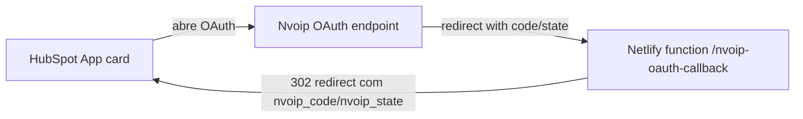

# Callback on Netlify

**Overview**

- Criar e documentar a função Netlify `/nvoip-oauth-callback` em `https://integration-nvoip.netlify.app` de modo que o HubSpot receba o callback completo com `state`, `code`, `error` e `nvoip_*`.
- Atualizar o app HubSpot e a configuração de permissões para usar a URL pública e os `permittedUrls` corretos, garantindo que o handler tenha acesso às credenciais (`client_id` e `client_secret`).
- Registrar o fluxo completo em `docs/netlify-callback-plan.md`, incluindo variáveis de ambiente e testes finais para validar o redirecionamento real.

## Todos

1. **setup-netlify-handler** — Implementar `netlify/functions/nvoip-oauth-callback.js` (ou `.ts`) com `exports.handler = async (event)` que:

   - Parseia `code`, `state`, `error` e extras da query string enviada pela Nvoip.
   - Decodifica `state` (base64 JSON) e extrai `returnUrl`, `accountId`, `portalId`, reconstruindo o `nvoip_state`.
   - Monta o redirect final para o HubSpot apontando para `returnUrl`/`portalId`, anexando `nvoip_code`, `nvoip_state`, `error` e responde com `302`.
   - Configura cabeçalhos CORS (`Access-Control-Allow-Origin`, `Access-Control-Allow-Headers`, `Access-Control-Allow-Methods`).

2. **hubspot-app-config** — Atualizar `src/app/settings/nvoipAuth.ts` e `src/app/app-hsmeta.json` para:

   - Usar `https://integration-nvoip.netlify.app/nvoip-oauth-callback` em `REDIRECT_URI` e `FALLBACK_REDIRECT`.
   - Liberar o domínio `integration-nvoip.netlify.app` em `permittedUrls.fetch` e `permittedUrls.iframe`.
   - Documentar o `client_id` e `client_secret` usados (incluindo `c4d7a76a-4239-4dd9-ac1d-530a0e4098e2`) para que o handler possa trocar o `code` por token quando necessário.

3. **netlify-env-vars** — Definir secrets no painel Netlify:

   - `
   HUBSPOT_CLIENT_ID` com o client id informado (usar exatamente como recebido).
   - `HUBSPOT_CLIENT_SECRET` com `c4d7a76a-4239-4dd9-ac1d-530a0e4098e2`.
   - `HUBSPOT_REDIRECT_URI` apontando para a URL do handler e outros parâmetros úteis (base URL, etc.).
   - Especificar no documento como essas variáveis são acessadas pelo handler e se serão usadas apenas para log/monitoração ou para chamar `/auth/oauth2/token`.

4. **netlify-doc** — Criar `docs/netlify-callback-plan.md` com seções sobre:

   - Configuração do site Netlify (domínio, build, functions).
   - Implementação do handler e os headers esperados.
   - Variáveis de ambiente, incluindo `HUBSPOT_CLIENT_ID`/`SECRET` e qualquer url de retorno.
   - OAuth flow: HubSpot → Nvoip → Netlify → HubSpot.
   - Testes (`netlify dev`, `hs project upload`, navegação real via navegador).
   - Lista de funções (callback e possíveis jobs de refresh) e um pequeno diagrama Mermaid ilustrando o fluxo.

5. **test-deploy** — Validar o fluxo final:

   - Rodar `netlify dev` ou `netlify build` para testar emular o callback localmente.
   - Fazer `hs project upload` e garantir que o HubSpot consiga redirecionar para `https://integration-nvoip.netlify.app/nvoip-oauth-callback`.
   - Confirmar nos logs que o handler reconstrói corretamente o estado e passa `nvoip_code/nvoip_state` de volta.

