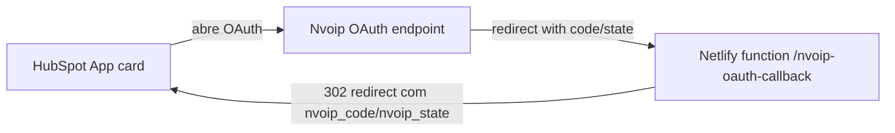

# Visão geral da aplicação HubSpot Callback

## Objetivo

Esta aplicação serve como contrato entre o app HubSpot e a Nvoip: a página pública informa onde está o callback (`https://hubspot-callback.netlify.app/nvoip-oauth-callback`) e o handler Netlify garante que o fluxo Authorization Code receba o `state`, valide os dados, troque o `code` por tokens e retorne o usuário ao HubSpot com os parâmetros esperados (`nvoip_code`, `nvoip_state`, `portalId`, `accountId`, etc.).

## Estrutura principal

1. **Front-end (Vite + React)**
   - `src/App.tsx` renderiza uma landing page simples com informações das rotas, permissões e credenciais.
   - `src/App.css` + `src/index.css` estilizam a interface com visual escuro e grade responsiva.
   - `src/app/settings/nvoipAuth.ts` centraliza as URLs de redirect e expõe os env vars `VITE_HUBSPOT_CLIENT_ID`/`VITE_HUBSPOT_CLIENT_SECRET` para o HubSpot (com placeholders caso não estejam definidos).
   - `src/app/app-hsmeta.json` documenta as URIs permitidas e as instruções de atualização do client_id/secret no painel HubSpot.

2. **Handler Netlify (`netlify/functions/nvoip-oauth-callback.js`)**
   - Processa GET/POST da Nvoip com `code`, `state`, `error`.
   - Valida e decodifica o `state` (base64 JSON) para recuperar `returnUrl`, `portalId`, `accountId`.
   - Troca o `code` por tokens (`access_token`, `refresh_token`) chamando `HUBSPOT_TOKEN_URL` (padrão `https://api.nvoip.com.br/auth/oauth2/token`) usando `HUBSPOT_CLIENT_ID`/`HUBSPOT_CLIENT_SECRET`.
   - Reconstrói o redirect ao HubSpot, anexando `nvoip_*` e informações do state.
   - Responde `OPTIONS` com 204 e adiciona cabeçalhos CORS ao redirect.
   - O resultado da troca de token é incluído no corpo JSON para facilitar logs.

3. **Handler iframe e páginas auxiliares**
  - `netlify/functions/hs-iframe-handler.js` recebe a chamada do HubSpot para o botão “abrir URL externa em iframe”, loga `portalId`, `accountId`, `returnUrl` e gera o `state` com o mesmo formato usado no callback.
  - O endpoint responde `{ response: { iframeUrl: "https://hubspot-callback.netlify.app/nvoip-oauth-iframe?..."} }`, entregando a URL com os parâmetros dinâmicos.
  - A página `public/nvoip-oauth-iframe.html` inicia automaticamente a tela de autorização da Nvoip assim que é carregada, mantendo todo o fluxo dentro do iframe (sem botões) e permitindo observar o state enquanto o callback do handler troca o código por tokens.
  - `public/oauth-iframe-entry.html` é o entrypoint que o HubSpot chama para ir direto ao `/auth/oauth2/authorize` assim que o iframe abre; ele busca `oauth-config`, monta a query string correta (com state) e chama `window.location.replace(...)`.
  - `netlify/functions/oauth-config.js` expõe as credenciais e `scope` usados pela página, mantendo o frontend desacoplado das env vars.
4. **Configurações e variáveis**
   - `HUBSPOT_CLIENT_ID`, `HUBSPOT_CLIENT_SECRET`, `HUBSPOT_TOKEN_URL`, `HUBSPOT_REDIRECT_URI` definem credenciais e rota no Netlify.
   - `VITE_HUBSPOT_CLIENT_ID` e `VITE_HUBSPOT_CLIENT_SECRET` propagam esses valores para o front-end React.

4. **Documentação e plano**
   - `docs/netlify-callback-plan.md` descreve o fluxo, testes e diagramas mermaid.
   - `docs/app-overview.md` (este arquivo) detalha a arquitetura funcional atual.

## Fluxo resumo

1. HubSpot inicia OAuth direcionando o usuário à Nvoip com `client_id` registrado.
2. Nvoip redireciona ao handler Netlify (`/nvoip-oauth-callback`) com `code`, `state`, `error`.
3. O handler decodifica o `state`, troca o `code` por tokens, insere `portalId`/`accountId` e monta o redirect final.
4. O usuário retorna ao HubSpot com `nvoip_code`, `nvoip_state` e demais dados em query string; o `access_token` pode ser logado ou persistido conforme necessidade.

## Deploy e testes

- Build React: `npm run build`; publicar com `netlify`/`hs project upload`.
- Testar handler local com `netlify dev`.
- Validar OAuth navegando no HubSpot, inspecionando logs Netlify para certificar que o state foi decodificado e o token trocado.

## Pontos de atenção

- Garanta que `HUBSPOT_CLIENT_ID`/`HUBSPOT_CLIENT_SECRET` sejam mantidos em secrets (Netlify env vars).
- Atualize o `app-hsmeta.json` com o client ID real antes de subir ao HubSpot.
- O handler já fornece o token trocado e mensagens no corpo, mas você pode evoluir para persistir `refresh_token`/`access_token` em um storage externo caso necessário.

