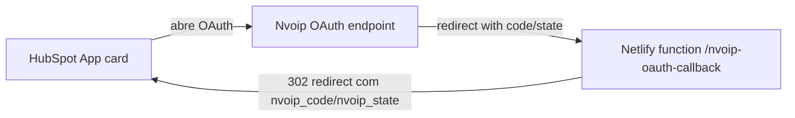

# Plano de callback Netlify

## 1. Configuração do site Netlify

- **Domínio alvo:** `https://hubspot-callback.netlify.app`
- **Function path:** `/nvoip-oauth-callback` exposto via `netlify/functions/nvoip-oauth-callback`
- **Build:** `npm run build` e publicação via `hs project upload`
- **Public:** o `App` está renderizando uma página estática com instruções; o callback ocorre na função serverless

## 2. Handler Netlify (`netlify/functions/nvoip-oauth-callback.js`)

- Recebe o `code`, `state`, `error` e quaisquer query params enviados pela Nvoip.
- Decodifica `state` (base64 JSON) para validar e reconstruir `returnUrl`, `accountId` e `portalId`.
- Tenta trocar o `code` por tokens chamando `https://api.nvoip.com.br/auth/oauth2/token` usando `HUBSPOT_CLIENT_ID`/`HUBSPOT_CLIENT_SECRET`; o resultado fica exposto nos logs da função.
- Reconstrói a URL de destino (priorizando o `returnUrl` contido no state) e anexa `nvoip_code`, `nvoip_state`, `error`, `portalId` e `accountId`.
- Em vez de devolver um 302 puro, responde com um HTML que envia `window.parent.postMessage({ action: 'DONE', tokens })` e logo em seguida faz `window.location.replace(...)`, garantindo que o iframe receba o evento antes de vestir para o HubSpot.
- Responde `OPTIONS` com 204 para permitir preflight.

## 3. Variáveis de ambiente Netlify

- `HUBSPOT_CLIENT_ID` → client_id oficial do app HubSpot.
- `HUBSPOT_CLIENT_SECRET` → `c4d7a76a-4239-4dd9-ac1d-530a0e4098e2` (pode ser redefinido no painel).
- `HUBSPOT_TOKEN_URL` → (opcional) endpoint de token; padrão `https://api.nvoip.com.br/auth/oauth2/token`.
- `HUBSPOT_REDIRECT_URI` → `https://hubspot-callback.netlify.app/nvoip-oauth-callback`.
- `VITE_HUBSPOT_CLIENT_ID`/`VITE_HUBSPOT_CLIENT_SECRET` → expõe as credenciais para o frontend, evitando hardcode.
- O handler usa `HUBSPOT_REDIRECT_URI` para reforçar o destino e as credenciais para trocar o `code` por token em `/auth/oauth2/token` antes de gerar o redirect.

## 4. Fluxo OAuth (Authorization Code)

1. HubSpot abre o OAuth da Nvoip apontando para o callback configurado.
2. Nvoip redireciona para `https://hubspot-callback.netlify.app/nvoip-oauth-callback` com `code`, `state`, `error`.
3. O handler decodifica o `state`, valida os dados (`returnUrl`, `portalId`, `accountId`) e monta o redirect para o HubSpot.
4. O usuário é redirecionado com `nvoip_code`, `nvoip_state` e `error` (se houver) no query string.
5. Opcional: o handler pode usar o `code` + credenciais para trocar token em `/auth/oauth2/token`.

## 5. Testes e deploy

- Local: `netlify dev` para validar o handler e inspecionar logs da função.
- Build: `npm run build` seguido de `hs project upload` com o endpoint Netlify publicado.
- Fluxo real: executar OAuth HubSpot/Nvoip e confirmar o redirect para `https://hubspot-callback.netlify.app/nvoip-oauth-callback`.
- Verificar nos logs Netlify que `state` foi decodificado e o redirect final contém `nvoip_code/nvoip_state`.

## 6. Lista de funções

- `nvoip-oauth-callback` (callback principal, reenvia `state` e codes).
- Futuro: job de refresh token (usa o `refresh_token`, se necessário).
- Documentar enumerações e flows no README/documento principal.

## 7. Diagrama

